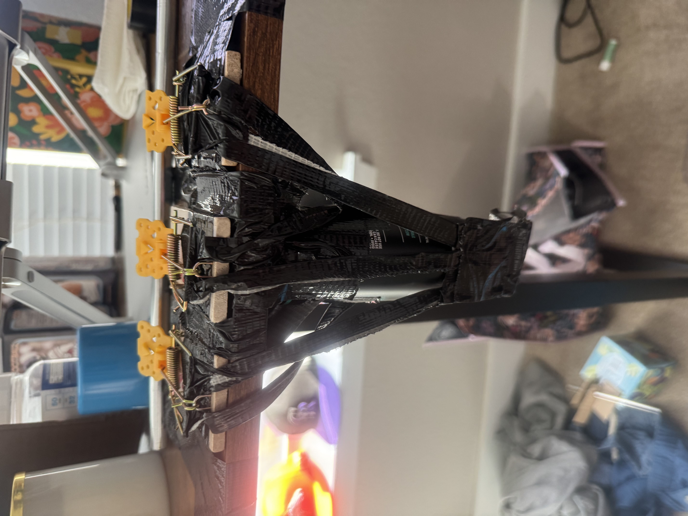
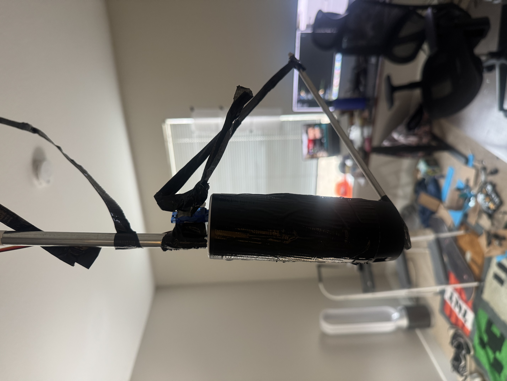

# Arduino Home Defense System / Axe Body Spray Booby Trap

I had just recently completed the video game *Uncharted 4*. Evading and working around booby traps made me think to myself, *“I could totally make one of these.”* So, inspired by the greats before me—Kevin McCallister, Rambo, etc.—I set out to create a booby trap/home defense system of my own.

## **Project Concept**
I had the idea of creating a tripwire system that, once triggered, would spray an intruder with pepper spray. However, using actual pepper spray would be awful for testing, and to be honest, I wasn’t entirely sure about the legality of automating it (the Geneva Convention kind of put a damper on my idea). So, I thought to myself, what’s the next best thing? **Axe Body Spray!** It’s not as dangerous as pepper spray, and it smells just as bad.

## **Prototype Development**
I started by creating a simple cardboard prototype to demonstrate how it would work. My idea was to set up a laser tripwire across the door. Once triggered, a servo would push down a swinging arm, activating another servo that would spray the Axe.

### **Prototype Test Video:**
[](https://www.youtube.com/watch?v=bq_6fXvCKoM)


After completing this basic prototype, I researched similar projects online to help me decide what parts I’d need to bring my idea to life. I settled on the following components:

### **Parts List**
- **Arduino Mega 2560**
- **2x SG90 Micro Servos**
- **Acxico Laser Sensor Module**
- **2x Small Breadboards**
- **Many Dupont Wires**

Once everything arrived, I felt like a kid on Christmas and got right to work. I started by testing each module individually to avoid future headaches. I wrote a simple script for testing each part, and thankfully, they all worked flawlessly.

### **Laser Sensor Test Video:**
[](https://www.youtube.com/watch?v=tWjzfdSZwzY)

### **Servo Test Video:**
[](https://www.youtube.com/watch?v=y1WvD0jofU8)


## **Setup & Testing**
Once I confirmed that everything was functional, I began installing the system in my room. To keep the bar in place, I used some tape and built a small cardboard holder.

#### **Cardboard Cutout:**


### **Arm Deployment Test Video:**
[](https://www.youtube.com/watch?v=vaL8QNNfnKI)

The next step was integrating the Axe Body Spray. This proved to be more challenging than expected. My tiny servos weren’t strong enough to press down on the can directly, so I initially thought of using a spring-loaded mechanism. I decided to use mousetraps because of their strong springs.

#### **Mousetrap Idea:**


While this method worked, it required three mousetraps, and it just wasn’t the solution I was looking for. Then, I remembered what my good friend Isaac Newton stood for: *Physics.* By extending the trigger length, I could reduce the amount of force needed to activate the spray.

#### **Revised Axe Method:**


## **Final Design & Adjustments**
This was a much better solution. However, once I started testing everything together, I ran into a new issue—because the Axe can added so much weight, the push-to-deploy mechanism was no longer effective.

### **Push Deployment Failure Video:**
[](https://www.youtube.com/watch?v=L_KSNuVxrJE)

To fix this, I switched from a **push-to-deploy** to a **pull-to-deploy** mechanism. Instead of pushing the spray can, I moved the servo to the wall and had it pull a rod off a platform, making it much easier to trigger.

### **Successful Test Video:**
[](https://www.youtube.com/watch?v=wg0jn0XNAmI)

Unfortunately, by this point, the Axe can was nearly empty, so barely any spray came out. I would have bought a new bottle, but as a broke college student, I had to choose between buying another can of Axe for my project or buying dinner. I chose dinner.

## **Arduino Code**
Here’s the simple Arduino script I wrote for the project:
```cpp
// Example Arduino code
#include <Arduino.h>
#include <Servo.h>
using namespace std;

int LED = 13;
int LaserSensor = 8;
int SensorReading = HIGH;  // HIGH MEANS NO OBSTACLE
int Laser = 7; 
Servo armServo, triggerServo;

void pushArm(){
  armServo.write(200);
  delay(500);
  armServo.write(0);
  
}

void trigServo(){
  triggerServo.write(180);
  delay(15000);
  triggerServo.write(0);

}

void setup() {
  pinMode(LED, OUTPUT);
  pinMode(Laser, OUTPUT);
  pinMode(LaserSensor, INPUT);
  armServo.attach(10);  // connect servo to pin
  armServo.write(0); // set servo to start pos
  triggerServo.attach(11);
  triggerServo.write(0);
}

void loop() {
  digitalWrite(Laser, HIGH); // turn laser on
  delay(200);
  SensorReading = digitalRead(LaserSensor);
  
  if (SensorReading == LOW) // if laser blocked
  {
    digitalWrite(LED, HIGH); // turn light on
    pushArm(); // push arm
    delay(1500);
    trigServo(); // trigger the spray
  }
  else{
    digitalWrite(LED, LOW);
  }
}
```

## **Conclusion**

This project was a fun and chaotic learning experience. If I were to do it again, I’d use stronger servos and try to find a 3D printer I could use. But for now, it works… kind of.

